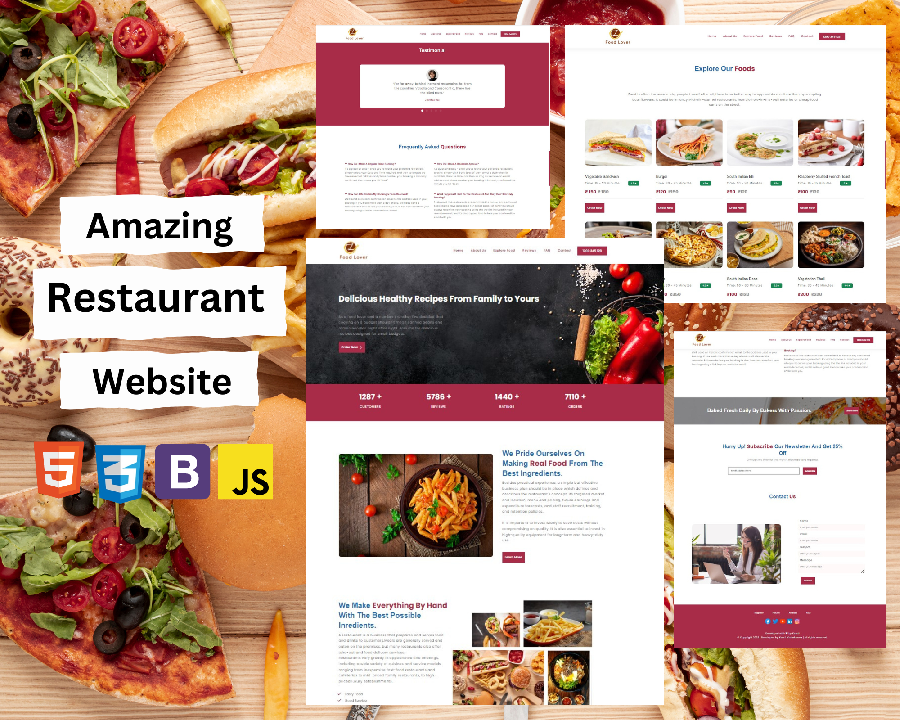

# Atlântico Restaurante

Esta é uma 'landing page' feita em HTML, CSS e JavaScript pensada para aumentar o o público do já existente restaurante

## 📖 Descrição

É um projeto simples de site feito a partir da proposta da matéria eletiva 'Marketing digital e Websites'.
 
Ele é composto por um banner inicial e diferentes seções na mesma página. Temos seções que explicam sobre o site, um catálogo, feedbacks reais e um suporte ao cliente.

## 🛠 Feito com

* HTML
* CSS
* BOOTSTRAP
* JAVASCRIPT
